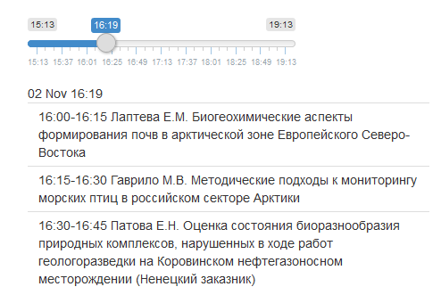

# Wildlife of the Arctic

## Release

https://sevin.000webhostapp.com/wildlifeArctic/

## General
This is a mock-up to reproduce auxiliary website for the "Wildlife of the Arctic" conference,
which has passed in Arkhangelsk, 29 October - 04 November 2017.
This development was initialized for management of resources,
missed of official conference website https://online.reg/aes2017.


## To build:

```
bookdown::render_book('index.Rmd',params=list(md_lang="ru"))
bookdown::render_book('index.Rmd',params=list(md_lang="en"))
dst <- rmarkdown::render("index.Rmd",encoding="utf8")
file.rename(dst,"./web/index.html")
unlink("assets",recursive=TRUE)
```

## To run:

Open `./web/index.html`

## Notes

+ Source data (abstracts) and scripts for data preparation are excluded.

+ Russian version has more features due to priority in development, because the most participants were Russian-spoken.

+ There is a link to https://www.shinyapps.io from main page in Russian. Please keep patience for "404" error.
That means application (board of actual schedule) is temporally in archive mode due to limitations of Free Plan.
See example of interface below.

  
